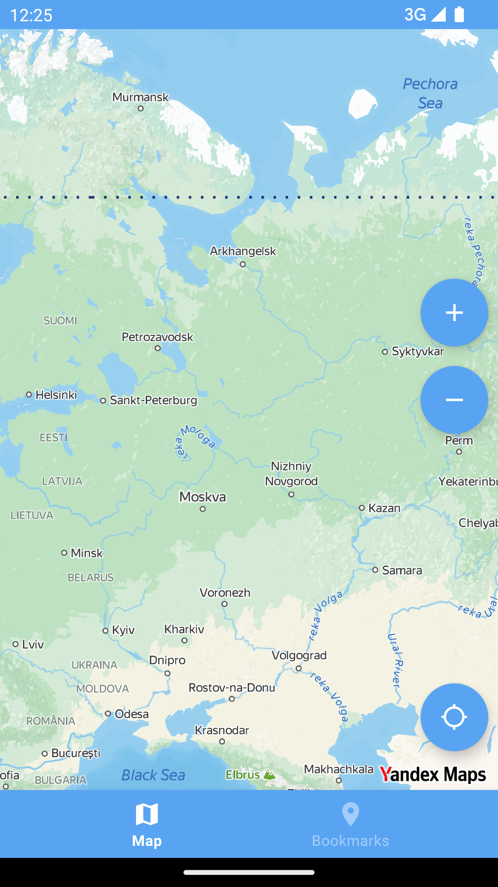
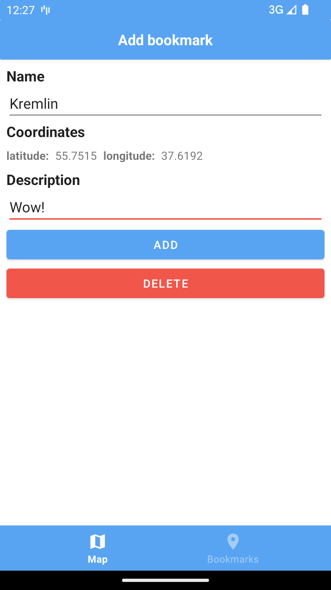
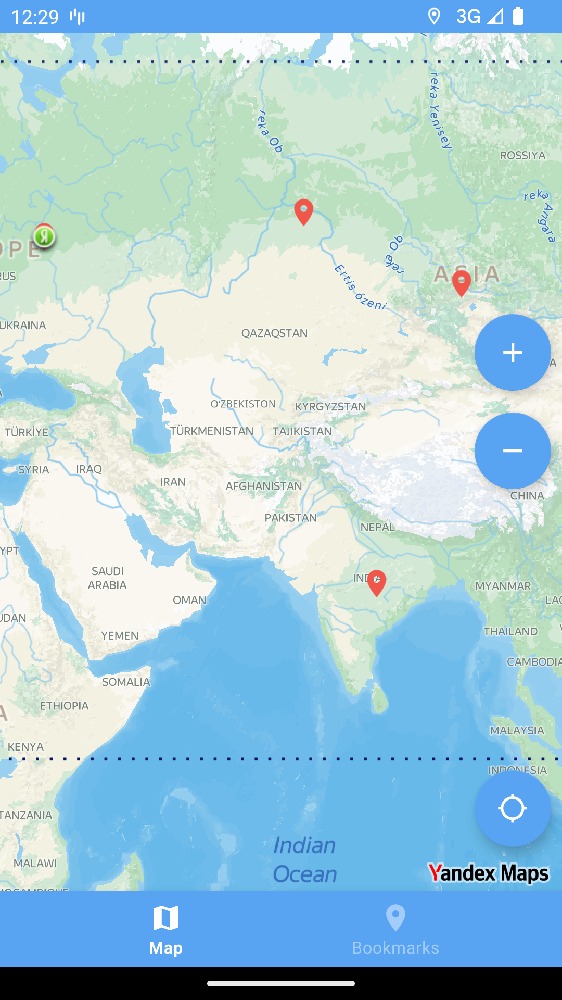
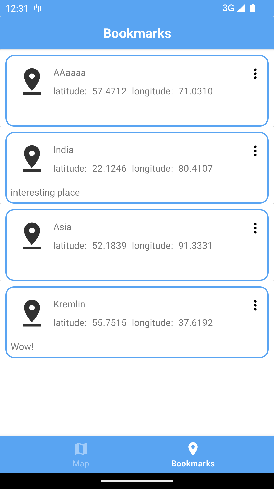

# Мини-проект Travel Markers

     

**Приложение поддерживает:**
1. Создание маркера по клику на карте.
2. Отображение на карте добавленных маркеров.
3. Редактирование маркера.
4. Удаление маркера.
5. Просмотр всех точек списком на отдельном экране.
6. При клике по маркеру из списка происходит переход к нему на карте.

Все созданные точки хранятся на устройстве. 

**Использованные библиотеки:**
1. Yandex MapKit
2. Navigation Architecture Component
3. Room
